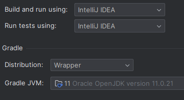
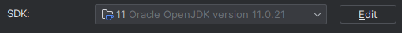
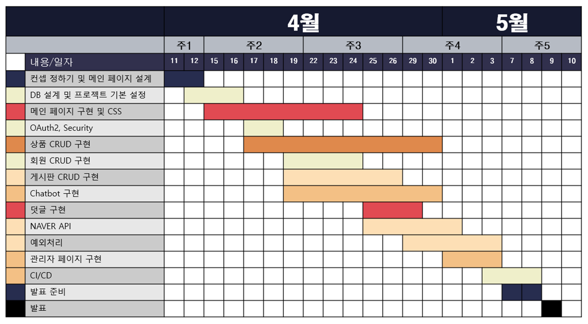
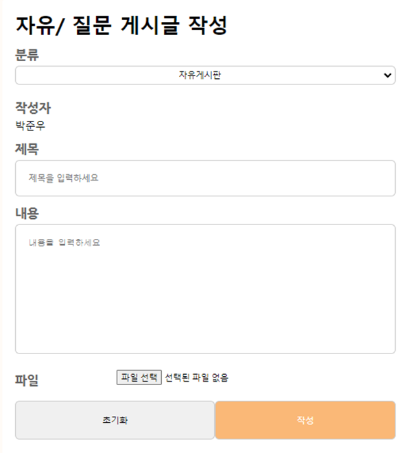
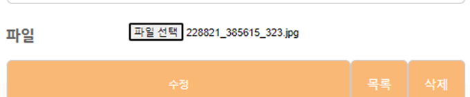
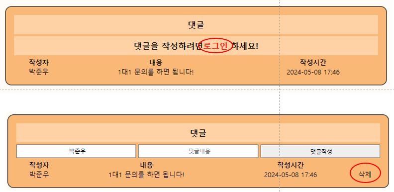
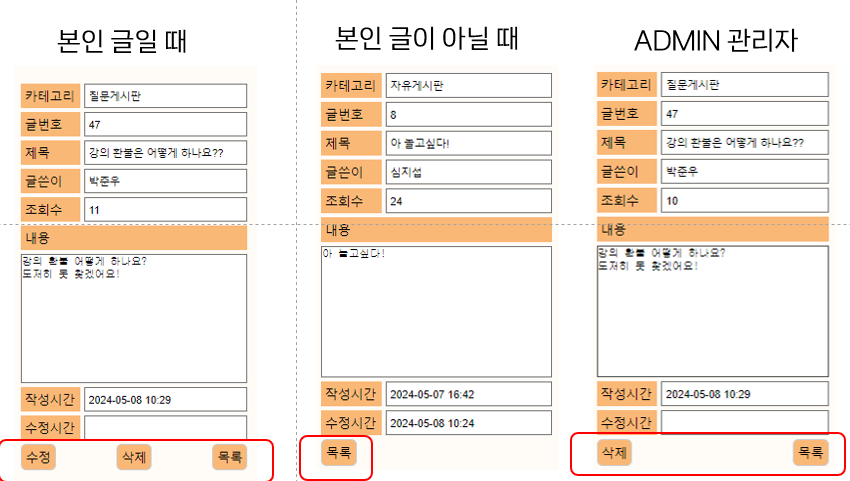
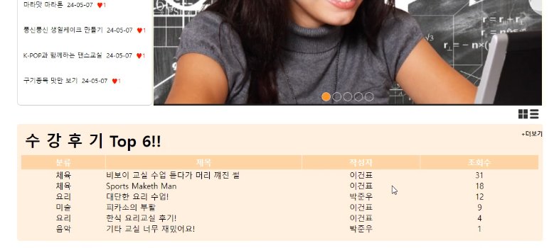
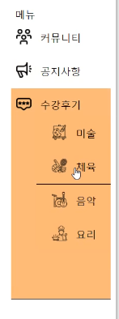

# E1I4TeamProject

## 🔍 전체 목차 
- [개요](#프로젝트-개요) 
- [주요 기능](#-주요-기능-) 
- [프로젝트 상세](#-프로젝트-상세-) 

1차 프로젝트 기본설정

프로젝트명 : E1i4TeamProject

프로그래밍 언어 : JAVA

프레임워크 : Springboot 2.7.11

라이브러리 DI : Spring WEB(MVC), Thymeleaf, Spring Data JPA, Lombok, SpringSecurity5 
               , websocket, validation, OAuth2, security  

데이터베이스 : MySql8

ORM : Spring Data JPA (JAVA(SQL))

개발툴 : IntelliJ

템플릿 엔진 : Thymeleaf (HTML + Data)

빌드 : Gradle

설정 : application.yml, application-oauth2.yml(google,naver,kakao api 키 필요)

기타 설정: 
1. setting - gradle 
  
2. project Structure - SDK -> 11  
     

## 📌 프로젝트 Git 다운로드 주소 📌 
$git clone https://github.com/Sim-Ji-Seob/Project1_E1I4.git  
branch : master

# 📝프로젝트 개요
## 🗓️일정
  

## 📝개요

프로젝트 개요

1차 프로젝트는 강좌를 구매하는 판매사이트를 만들었습니다. 최근 온라인 강의 뿐만 아니라 오프라인강의도 
온라인으로 구매를 하는 경우가 많아졌습니다. 따라서 사용자 입장에서 편리하게 사용하고 
계속해서 이용하고 싶은 사이트를 구현하였습니다.

 

## 🖱️개발 환경🖱️
### 💻사용 프로그램💻  

### 🛠개발 환경 🛠  

  

# ⚡ 팀원별 역할 ⚡
- [ ] 박** (팀장) : DB설계, 회원 CRUD, Oauth2, Security, CI/CD
- [ ] 손** (팀원) : 관리자페이지, ChatBot, 강사소개 페이지, 메뉴바, INDEX 애니메이션 기능
- [x] _**심지섭 (팀원) : 게시판 CRUD, Naver API**_
- [ ] 이** (팀원) : 상품 CRUD, Cart 담당
- [ ] 조** (팀원) : INDEX 페이지, 1:1 문의내역, Naver API

#  🚀 주요 기능 🚀

| 기능        | 설명                                                                            | 
|-----------|-------------------------------------------------------------------------------|
| 게시글 작성    | 게시글 작성  게시글 종류 선택(자유/질문, 공지사항, 수강후기(4종류) )                              |
| 게시글 수정    | 게시글의 종류와 제목 등 데이터 수정                                                      |
| 게시글 삭제    | 본인글만 삭제 가능, ADMIN 권한자는 모든 글 삭제 가능                                             |
| 게시글 댓글    | 게시글마다 댓글 기능 구현(작성, 삭제 가능)                                                     |
| 게시글 검색    | 게시글의 제목과 내용 중 하나를 선택하여 해당 키워드를 검색                                             |
| 회원 권한     | 권한에 따라 작성할 수 있는 게시글 종류 제한  권한에 따라 삭제,수정 기능 제한  ADMIN 계정은 모든 글, 댓글 삭제 가능 |
| Index 페이지 | Index 페이지에 조회수에 따른 인기 수강후기 게시글 출력                                             |

# 📁 프로젝트 상세 
## 목차
1. [게시글 CRUD](#-게시글-CRUD-)
2. [목록, 검색, 페이징](#2-목록-검색-페이징-기능)
3. [댓글 기능](#-댓글-기능-)
4. [권한에 따른 기능](#-권한에-따른-기능)
5. [Index 페이지](#-Index-페이지-)
6. [사이드바]()

## 1️⃣ 게시글 CRUD  
글 작성시 게시글의 종류를 선택할 수 있습니다. 또한 작성자란에는 로그인한 회원의 이름이 출력되도록 했습니다. 
작성시 글의 종류는 카테고리 값으로 설정하여 하나의 Entity에 통합하여 사용하도록 했습니다.
  
 

파일을 선택해서 넣게 되면 사진처럼 선택된 파일 이름이 나오게 됩니다. 
  

수정과 삭제는 게시글의 Board_Id를 통해 글 정보를 가져오고 서비스를 사용해 실행합니다.

## 2️⃣ 목록, 검색, 페이징 기능
게시글 목록에서 제목과 내용 중 하나를 선택하여 검색을 할 수 있습니다. 일부의 내용만 포함하더라도 검색이 가능합니다.
또한 글이 많을 시 페이지를 이동할 수 있도록 하는 기능도 구현하였습니다. 맨앞, 맨뒤 페이지도 이동하는 기능도 추가하였습니다.

## 3️⃣ 댓글 기능 
  
게시글에는 댓글을 달 수 있도록 기능을 구현했습니다. 로그인의 상태에 따라 댓글 기능사용에 제한을 두었습니다. 
또한 권한을 나누어 본인 댓글만 삭제 할 수 있도록 구현하였습니다. ADMIN 권한자는 모든 댓글을 삭제 할 수 있습니다.

## 4️⃣ 권한에 따른 기능 
  
권한에 따라서 글 상세보기에서의 버튼들이 다르게 보이도록 설정했습니다. 본인 글이 아니라면 수정, 삭제를 할 수 없습니다.
ADMIN 권한자만 공지사항 게시글을 작성 할 수 있으며 모든 글을 삭제할 수 있습니다.

## 5️⃣ Index 페이지 
  
Index Main 페이지에서 수강후기 게시글의 조회수 순위대로 보이도록 하였습니다. 
a태그를 활용하여 상세정보로 이동할 수 있도록 하였으며, 그리드와 리스트로 바꿀 수 있는 버튼도 만들었습니다.

## 6️⃣ 사이드바
  
사이드바 메뉴를 만들어 게시판에서의 이동을 편리하게 만들었습니다.
또한 수강후기에는 4개의 카테고리가 있어서 마우스를 Hover 시에 submenu가 아래로 내려오는 drop 형식을 사용했습니다.

[⬆⬆맨위로⬆⬆](#E1I4TeamProject)

